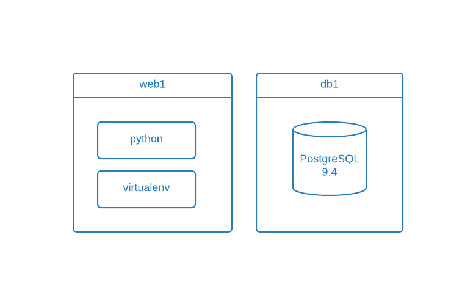

# Python Devbox

The project contains a devboxes for python projects which use PostgreSQL as their database.

## Overview

Software Stack on VM:

## Requirements

- [Vagrant](http://www.vagrantup.com/)
- Vagrant Plugins:
    - Vagrant Cachier Plugin:

            vagrant plugin install vagrant-cachier

    - Vagrant Host Manager Plugin:

            vagrant plugin install vagrant-hostmanager

  Visit my [blog post](http://czerasz.com/2014/12/10/top-vagrant-plugins/) for more details.

- [Virtualbox](https://www.virtualbox.org/)
- on Ubuntu host install NFS (on Mac it's already there):

        sudo apt-get install nfs-common nfs-kernel-server -y

- on OSX 10.10 (Yosemite) you might need to configure your firewall to allow incoming connections for NFS related services

    - execute the following commands:

            /usr/libexec/ApplicationFirewall/socketfilterfw --unblockapp /usr/sbin/netbiosd;
            /usr/libexec/ApplicationFirewall/socketfilterfw --unblockapp /sbin/nfsd;
            /usr/libexec/ApplicationFirewall/socketfilterfw --unblockapp /usr/sbin/rpc.lockd;
            /usr/libexec/ApplicationFirewall/socketfilterfw --unblockapp /usr/libexec/rpc.rquotad;
            /usr/libexec/ApplicationFirewall/socketfilterfw --unblockapp /usr/libexec/rpc.rquotad;
            /usr/libexec/ApplicationFirewall/socketfilterfw --unblockapp /usr/sbin/rpc.statd;
            /usr/libexec/ApplicationFirewall/socketfilterfw --unblockapp /usr/sbin/rpcbind;

    - reboot and start over - the firewall configuration should be correct now

    The resource for this issue can be found [here](https://github.com/mitchellh/vagrant/issues/1093#issuecomment-17209368). More info and possible alternative solutions (not tested) can be found [here](https://github.com/kalamuna/kalastack/issues/45)

## Setup

Start devboxes

    vagrant up

Shh to the web box

    vagrant ssh web1

Create a new virtualenv:

    mkvirtualenv myawesomeproject

to exit your `virtualenv`, type `deactivate` in your shell.

Load or switch between enviornments:

    workon myawesomeproject

Install libraries from file:

    pip install -r requirements.txt

## Django Tips

Below are some helpful commands which you can use during a Django project setup.

Django first run:

    python manage.py syncdb

Start Django server:

    python manage.py runserver 0.0.0.0:8000

## Resources:

- http://roundhere.net/journal/virtualenv-ubuntu-12-10/
- [How to install PostgreSQL 9.4 on Ubuntu 14.10](http://www.unixmen.com/install-postgresql-9-4-phppgadmin-ubuntu-14-10/)